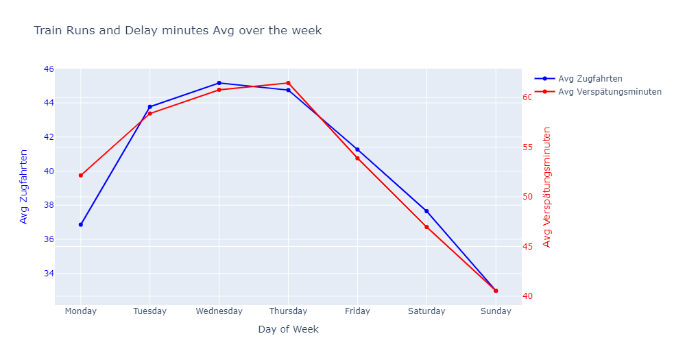
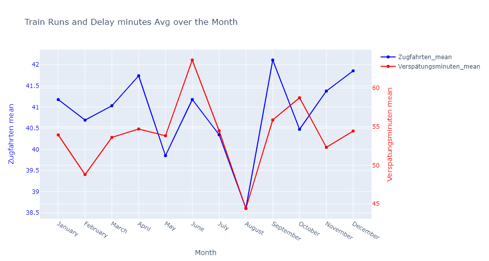

### Exploratory Data Analysis Deutsche Bahn Cargo

🎯 Objective:
To identify patterns or regularities within a sample dataset from DB Cargo.

### Dataset (Actual DB Cargo traffic data at Bst8 level)

The data provided here represent the number of train journeys and delay minutes per day
and operating point. All Bst over which at least 10 train journeys took place were taken into
account.

Interpretation: Train journeys and delay minutes are essential indicators for the traffic at a service point. The train journeys show how heavily the operating point is used. The delay minutes that occur at a service point show whether there were disruptions at this service point, and if so, to what extent.

- BST_NR_8: This internal code or number identifies each depot. It can be used as a key for the connection with the data set "Depot register freight traffic" with the column "BST8".

- PROD_DATUM: Production date. The day for which the data in the columns "Train runs" and "Delay minutes" were measured. This represents the day when the train journeys were recorded.

- Zugfahrten (Train runs): Number of train runs of DB Cargo that ran on the day specified by the column "PROD_DATUM" via the operating point specified in the column "BST_NR_8".

- Verspätungsminuten (Delay minutes): Total of DB Cargo's delay minutes recorded on the day specified by the column "PROD_DATUM" for the operating point specified in the column "BST_NR_8".

### Analysis

The table below shows the entries in the dataset where there are multiple records
for the same operating point on the same day.
For example, for the operating point with ID 80000000 on 2016-01-02, there are 73 train journeys with 2 minutes delay, 31 train journeys with 0 delay minutes, and 28
train journeys with 0 delays, etc. This means that the number of train journeys and delay minutes have been recorded at
different times during the day for the same operating point.

By analyzing the data, one can obtain this information ( see the notebook and presentation)
- There are 3184 individual operating sites
- The data is measured from January 2016 to December 2016
- Therefore, the expected number of days between the start and end dates is 344
- The number of individual days in the data set - 291
- And there are 53 days where no data was recorded

## Analyze the regularities in the data.
Plot 1: General distribution of Zugfahrten (Train journey/runs) and Verspätungsminuten (Delay minutes):

#### Interpretation Plot1:
Distribution of Train Runs: The histogram shows that most operating points have a relatively low number of train runs, with a few exceptions having a high number of train runs. The distribution is highly skewed to the right, indicating that the majority of operating points experience fewer train runs.

Distribution of Delay Minutes: Similarly, the majority of the data points have lower delay minutes. The distribution is also skewed to the right, indicating that most of the time, the delay minutes at the operating points are low, but there are some instances where the delay minutes are very high. These could potentially be due to significant disruptions.

## By Day of the Week
Plot 2: Average train journeys and delay minutes across days of the week

#### Interpretation Plot2: 
Average train journeys: The average number of train journeys is 
lowest on Sundays  and highest on Wednesdays. This indicates that
that train use is lower at weekends and peaks in the middle of the week.
Average delay minutes: The average delay minutes are also lowest on
Sundays and highest on Thursdays. This indicates that
delays are more likely to occur on weekdays, possibly due to higher train use.
Comparison between train journeys and delays: The trends for train journeys and
minutes of delay are similar, with both lower at weekends and higher on weekdays.
This indicates a positive correlation between the
number of train journeys and the number of delay minutes, i.e., more train journeys could lead to more delays.

Comparison between train journeys and delays: The trends for train journeys and
minutes of delay are similar, with both lower at weekends and higher on weekdays.
This indicates a positive correlation between the 
number of train journeys and the number of delay minutes, i.e., more train journeys could lead to more delays.

Plot 2.1: The FacetGrid plot  shows the relationship between the number of train runs and delay minutes for each day of the week. Each subplot is a scatter plot of train runs versus delay minutes for a specific day. This allows us to see if the relationship varies depending on the day of the week.

## By Month of the Year
Plot 3: Average train runs and delay minutes over the months of the year

## By Delay per Train
Plot 4: Average Delay per train run over the time

Plot 5: Average Delay per train run over days of the week

Plot 6: Average Delay per train run over the months of the year

## By the Operating Point

### Comparison of  Plot 2 and Plot 5 ----> indicate a couple of possibilities:

**Lower Train Frequency on Monday:** Monday may have fewer train journeys overall compared to Tuesday. With fewer trains running, any delays experienced by those trains could have a more significant impact on the average delay per train. Even if the average delay per train is higher on Monday, the lower number of train journeys results in a lower overall delay compared to Tuesday.

**Higher Delays on Critical Trains:** It's possible that on Monday, certain critical train journeys or routes experience higher delays compared to Tuesday. While the average delay per train might be higher on Monday, it doesn't necessarily mean that all train journeys are affected. Instead, specific trains or routes might be encountering significant delays, skewing the average for that day.

