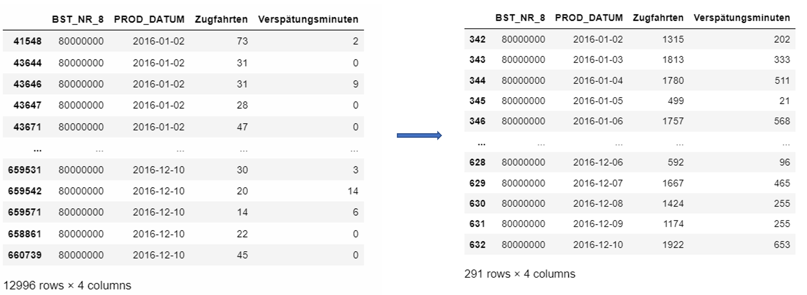
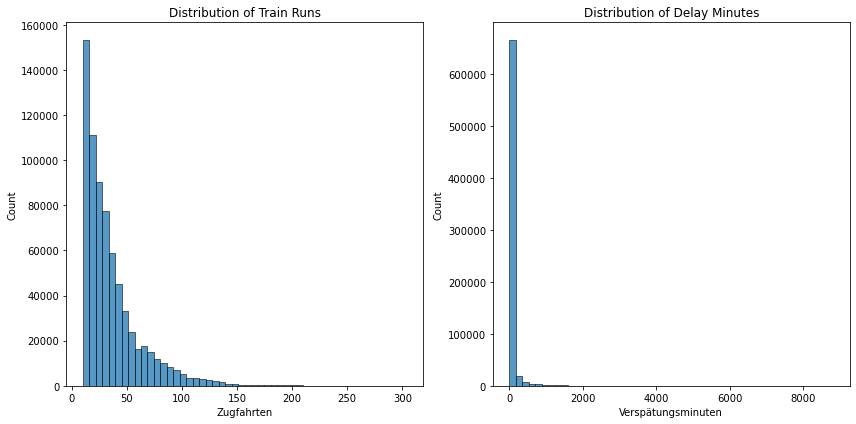
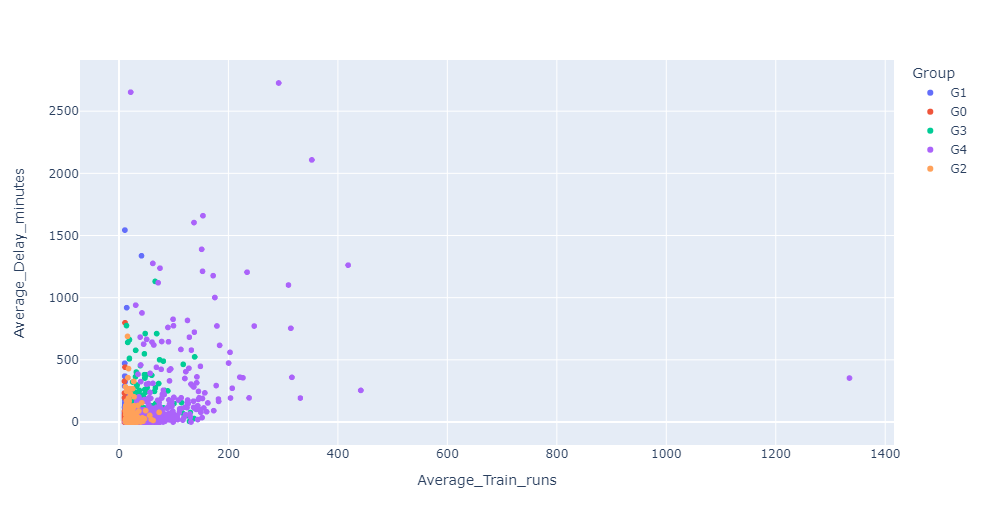

### Exploratory Data Analysis Deutsche Bahn Cargo

🎯 Objective:
To identify patterns or regularities within a sample dataset from DB Cargo.

### Dataset (Actual DB Cargo traffic data at Bst8 level)

The data provided here represent the number of train journeys and delay minutes per day
and operating point. All Bst over which at least 10 train journeys took place were taken into
account.

Interpretation: Train journeys and delay minutes are essential indicators for the traffic at a service point. The train journeys show how heavily the operating point is used. The delay minutes that occur at a service point show whether there were disruptions at this service point, and if so, to what extent.

- BST_NR_8: This internal code or number identifies each depot. It can be used as a key for the connection with the data set "Depot register freight traffic" with the column "BST8".

- PROD_DATUM: Production date. The day for which the data in the columns "Train runs" and "Delay minutes" were measured. This represents the day when the train journeys were recorded.

- Zugfahrten (Train runs): Number of train runs of DB Cargo that ran on the day specified by the column "PROD_DATUM" via the operating point specified in the column "BST_NR_8".

- Verspätungsminuten (Delay minutes): Total of DB Cargo's delay minutes recorded on the day specified by the column "PROD_DATUM" for the operating point specified in the column "BST_NR_8".

### Analysis

The table below shows the entries in the dataset where there are multiple records
for the same operating point on the same day.
For example, for the operating point with ID 80000000 on 2016-01-02, there are 73 train journeys with 2 minutes delay, 31 train journeys with 0 delay minutes, and 28
train journeys with 0 delays, etc. This means that the number of train journeys and delay minutes have been recorded at
different times during the day for the same operating point.

By analyzing the data, one can obtain this information ( see the notebook and presentation)
- There are 3184 individual operating sites
- The data is measured from January 2016 to December 2016
- Therefore, the expected number of days between the start and end dates is 344
- The number of individual days in the data set - 291
- And there are 53 days where no data was recorded

## Analyze the regularities in the data.
Plot 1: General distribution of Zugfahrten (Train journey/runs) and Verspätungsminuten (Delay minutes):

## By Day of the Week
Plot 2: Average train journeys and delay minutes across days of the week

Plot 2.1: The FacetGrid plot  shows the relationship between the number of train runs and delay minutes for each day of the week. Each subplot is a scatter plot of train runs versus delay minutes for a specific day. This allows us to see if the relationship varies depending on the day of the week.

## By Month of the Year
Plot 3: Average train runs and delay minutes over the months of the year

## By Delay per Train
Plot 4: Average Delay per train run over the time

Plot 5: Average Delay per train run over days of the week

Plot 6: Average Delay per train run over the months of the year

## By the Operating Point

